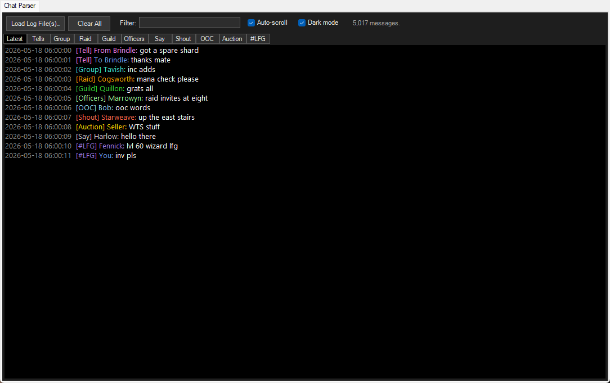

# ChatParserPlugin

An Advanced Combat Tracker (ACT) plugin for **EverQuest II** that pulls chat out of the log
stream and organizes it into per-channel tabs, so chat history is actually readable instead of
being buried in combat spam.



## What it does

- **Latest tab** - the first tab, and what the plugin opens on: every channel interleaved, each
  line tagged with where it came from (`[Guild] Quillon: grats all`, `[Tell] From Brindle: ...`,
  `[#LFG] ...`). It only collects chat that arrives live while ACT is running; backlog loads and
  ACT log imports go to their channel tabs but never to Latest.
- **Tabs per channel** - Group, Raid, Guild, Officers, Say, Shout, OOC, Auction, plus a tab for
  every custom channel it sees (`#LFG`, `#General`, `#Crafting`, …), each line timestamped.
- **Tells broken down per player** - the *Tells* tab contains a nested tab per player holding both
  sides of that conversation (`From Brindle:` / `To Brindle:`), plus an *All Tells* chronological view.
  Player tabs are ordered most recent conversation first; a tell in either direction moves that
  player's tab to the front (the tab you are reading stays selected).
- **Dark mode** - white text on black, with a dark toolbar and tab strip. On by default; untick
  *Dark mode* for the light theme. The choice is saved to
  `%APPDATA%\Advanced Combat Tracker\Config\ChatParserPlugin.config.xml`.
- **Backlog loading** - *Load Log File(s)…* parses any `eq2log_*.txt` directly (multi-select
  supported), without importing them into ACT. The currently-written log can be loaded too.
  Files are read in 1 MB blocks that are parsed in parallel, so a few GB loads in seconds and
  the UI stays responsive while it does.
- **Live parsing** - hooks ACT's `OnLogLineRead`, so whatever log ACT is currently following
  streams into the tabs as you play. Lines are taken in batches (at most every 50 ms, and at
  once after a quiet spell), so an ACT log import (*Import/Merge*) fills every channel tab in
  a moment and the shown tab jumps straight to its newest line instead of scrolling through
  the import.
- **Filter box** - case-insensitive search over message text and speaker names, applied to the
  current tab (and every other tab when you switch to it).
- Item links in chat are cleaned to `[Item Name]`; player-name link markup is stripped.

## Installation

Option A — load the source directly (no build needed):

1. ACT → **Plugins** → **Plugin Listing** → **Browse…**
2. Select `ChatParserPlugin.cs` → **Add/Enable Plugin**.

Option B — build a DLL:

```
dotnet build ChatParserPlugin.csproj
```

then add `bin\Debug\ChatParserPlugin.dll` in the same dialog. The csproj pins `LangVersion` to
C# 5 so the source always stays loadable via Option A (ACT's built-in compiler only supports
C# 5) — keep it that way when editing: no `$"..."`, no `?.`, no expression-bodied members.

## Notes / behavior

- **Timestamps** come from the log's 10-digit unix prefix `(1783263492)[...]` and are shown in
  local time. Live lines fall back to ACT's detected time if the prefix is missing.
- **Rendering cap**: a full redraw (after a backlog load, filter change or theme switch) draws
  the newest 4,000 messages of a tab as a single RTF load, so a tab appears already drawn and
  scrolled to its newest line. Everything stays in memory - use the filter to reach older
  lines. Live messages always append.
- **Auto-scroll** also applies when you switch tabs: the tab opens on its newest line.
- **Ordering**: after a backlog load, each tab is re-sorted by timestamp, so loading old files
  after live parsing has started still interleaves correctly.
- **Duplicates aren't detected** — loading the same file twice shows every message twice.
  Use *Clear All* and reload if that happens.
- No chat is persisted (only the dark mode choice); tabs start empty each session. Load the
  recent log file(s) to backfill.

## Supported line formats (verified against real Anashti Sul logs)

| Channel  | Received                                   | Sent                              |
| -------- | ------------------------------------------ | --------------------------------- |
| Tell     | `X tells you, "…"`                         | `You tell X, "…"`                 |
| Group    | `X says to the group, "…"`                 | `You say to the group, "…"`       |
| Raid     | `X says to the raid party, "…"`            | `You say to the raid party, "…"`  |
| Guild    | `X says to the guild, "…"`                 | `You say to the guild, "…"`       |
| Officers | `X says to the officers, "…"`              | `You say to the officers, "…"`    |
| Say      | `X says, "…"`                              | `You say, "…"`                    |
| Shout    | `X shouts, "…"`                            | `You shout, "…"`                  |
| OOC      | `X says out of character, "…"`             | `You say out of character, "…"`   |
| Auction  | `X auctions, "…"`                          | `You auction, "…"`                |
| Custom   | `X tells ChannelName (N), "…"`             | `You tell ChannelName (N), "…"`   |

where `X` is the EQ2 player-link markup `\aPC id Name:Name\/a` (stripped before matching).
NPC dialog (`says to you`, multi-word names) is intentionally not captured.

## Tests

```
dotnet build tests\ChatParserPlugin.Tests\ChatParserPlugin.Tests.csproj
tests\ChatParserPlugin.Tests\bin\Debug\ChatParserPlugin.Tests.exe [--only <name part>] [--no-real-logs]
```

A console runner (exit code 0 = all pass) that compiles `ChatParserPlugin.cs` itself and drives
the real plugin UI in a test window: live lines go through `OnLogLineRead`, backlog loads through
`ParseFilesWorker`, and screenshots land in `tests\ChatParserPlugin.Tests\artifacts\`. The
backlog tests compare every tab message-for-message with the original sequential parser
(`ReferenceParser.cs`). The window pops up briefly while the UI tests run. The fixtures use
made-up character names.

To also run the speed and equivalence tests on your own logs, list them one path per line in
`tests\ChatParserPlugin.Tests\real-logs.local.txt` (git-ignored); without it those tests are
skipped.

`--bench [--verify] [--block <bytes>] <files...>` times a backlog load (and with `--verify`
checks it against the original parser).

## Extending

All patterns are compiled `Regex` constants near the top of `ChatParserPlugin.cs`
(`RxTellIn`, `RxGroupIn`, …), matched in `ParseLine`. To add a channel type: add a regex pair,
add two `if` branches in `ParseLine`, and (for a fixed tab) add the name to `FixedChannels`.
